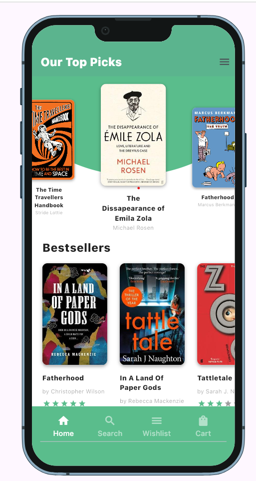
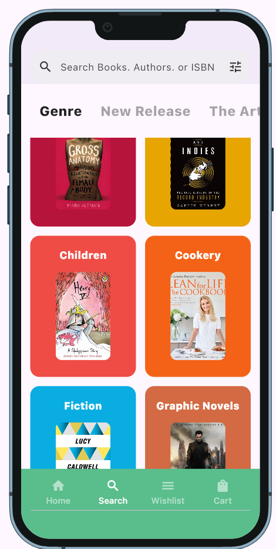
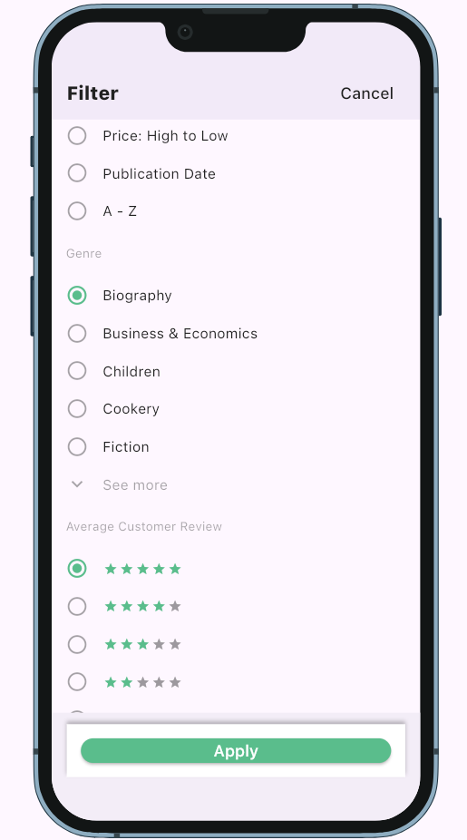

# 📚 Book UI App – Flutter 3

A beautifully designed **Book Store App UI** built entirely with **Flutter 3**.  
This project includes elegant onboarding screens, user flows, home screens, side menu, search, and book reading interfaces — all crafted with clean and responsive Flutter code.

---

## 🎯 Features

- Onboarding flow with smooth navigation
- Sign Up and Help Us screens
- Stylish Home Tabs
- Side Menu with intuitive access
- Search and Filter functionality
- Account and Book Reading screen
- Fully responsive and optimized for mobile

---
## 🎨 Screenshot



## 🚀 Getting Started

### 📦 Requirements

- Flutter SDK (version 3.x or later)
- Dart
- Android Studio / VS Code
- Android Emulator or iOS Simulator

### 🔧 Installation

```bash
git clone https://github.com/Krut369/book_ui.git
cd book_ui
flutter pub get
flutter run
